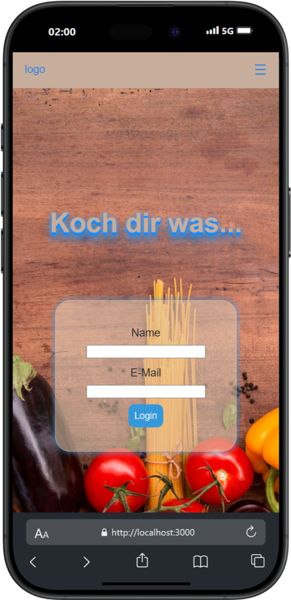
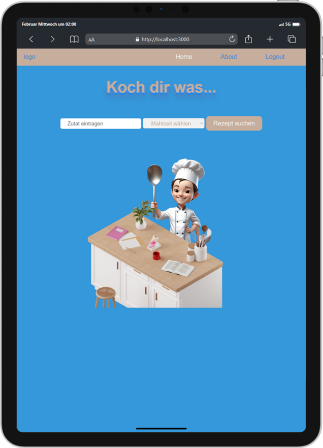
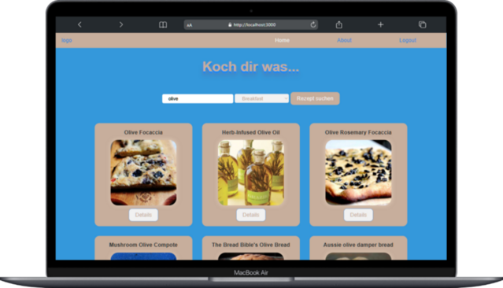

# 🍽️ Recipe Finder App - Koch dir was

🚀 **Live-Demo:** [issidee.vercel.app](https://issidee.vercel.app/)

Die **Recipe Finder App** hilft dir, köstliche Rezepte auf Basis deiner vorhandenen Zutaten zu finden. Egal, ob du eine spontane Mahlzeit planst oder einfach Inspiration für dein nächstes Gericht suchst – diese App macht es einfach und unterhaltsam! 🎉

## 🥄 Features

✅ **Zutatensuche:** Gib eine Zutat ein und erhalte passende Rezeptvorschläge.
✅ **Filter nach Mahlzeitentyp:** Wähle zwischen Frühstück, Mittagessen, Abendessen, Snack oder Teezeit.
✅ **Benutzerfreundliche Oberfläche:** Intuitives Design mit einfacher Navigation.
✅ **Login & Logout:** Sichere Sitzungen mit automatischem Logout beim Schließen der App.
✅ **Reaktionsschnelles Design:** Optimiert für Desktop und mobile Nutzung.

---

## 📸 Screenshots

| Login | Rezeptsuche | Rezepte |
|------------|------------|------------|
|  |  |  |

---

## 🛠️ Technologien

Die App wurde mit den folgenden Technologien entwickelt:

- ⚛️ **React.js** – Für die Benutzeroberfläche
- 🌐 **React Router** – Für das Navigationssystem
- 🎨 **CSS3** – Für das Styling
- 🔥 **Vercel** – Bereitstellung der App
- 🍲 **Edamam API** – Rezepte & Ernährungsinformationen

---

## 🔧 Installation & Nutzung (lokal)

Falls du die App lokal starten möchtest:

### 1️⃣ Klone das Repository

```bash
git clone https://github.com/DeinGitHubUser/DeinRepo.git
cd DeinRepo
```

### 2️⃣ Installiere die Abhängigkeiten

```bash
npm install
```

### 3️⃣ Starte die App

```bash
npm start
```

Die App wird unter [http://localhost:3000](http://localhost:3000) verfügbar sein.

---

## 🚀 Deployment

Die App ist bereits unter [issidee.vercel.app](https://issidee.vercel.app/) gehostet. Falls du eine eigene Version deployen möchtest, kannst du das mit Vercel tun:

```bash
npm run build
vercel
```

---

## 📜 Lizenz

Diese App ist unter der **MIT-Lizenz** veröffentlicht – du kannst sie gerne weiterentwickeln und anpassen. 🎉
